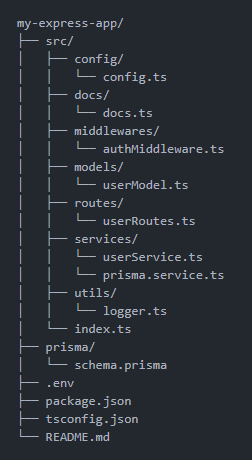
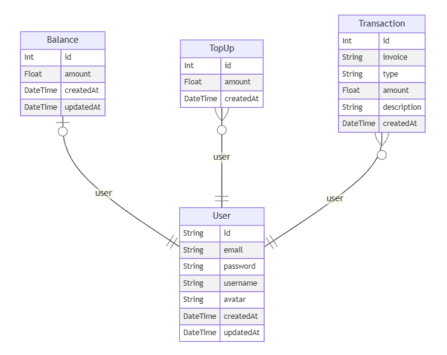

# My Express App

## Deskripsi

Proyek ini adalah aplikasi backend yang dibangun menggunakan Express, TypeScript, dan Prisma. Aplikasi ini menyediakan API untuk mengelola pengguna, termasuk registrasi, login, top-up saldo, dan transaksi.

## Struktur Proyek






<!-- my-express-app/
├── src/
│   ├── config/
│   │   └── config.ts
│   ├── docs/
│   │   └── docs.ts
│   ├── middlewares/
│   │   └── authMiddleware.ts
│   ├── models/
│   │   └── userModel.ts
│   ├── routes/
│   │   └── userRoutes.ts
│   ├── services/
│   │   └── userService.ts
│   │   └── prisma.service.ts
│   ├── utils/
│   │   └── logger.ts
│   └── index.ts
├── prisma/
│   └── schema.prisma
├── .env
├── package.json
├── tsconfig.json
└── README.md -->

## Installation

```bash
$ npm install
```

## Running the app

```bash
$ npm run start:dev
```
